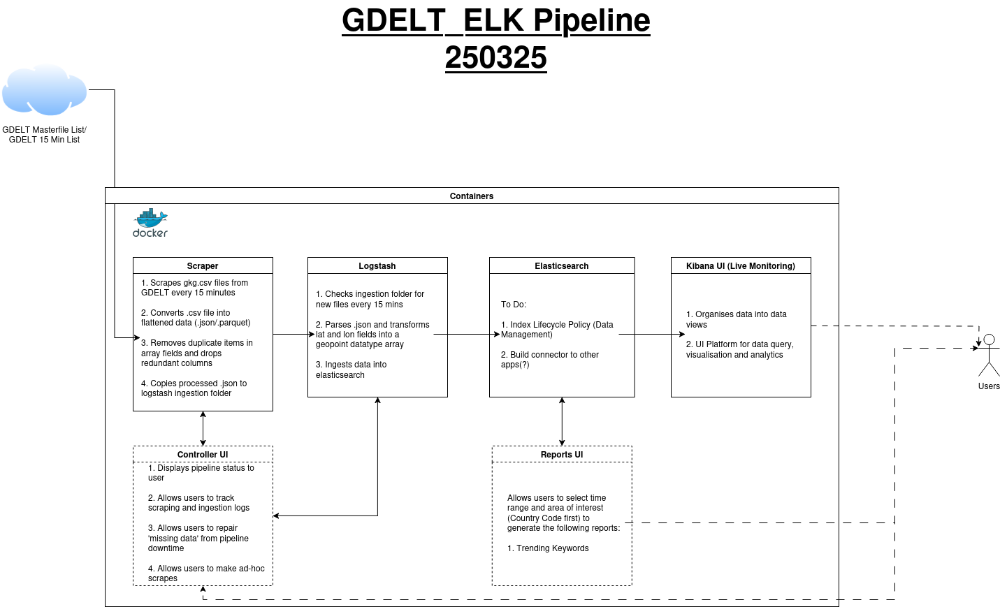

## Overview
This repository automates the process of converting CSV data to JSON format, flattening the JSON using Logstash, and indexing the flattened data into Elasticsearch. The project uses Docker Compose to manage the entire stack, which includes:

- Python Script to convert CSV files into JSON using PySpark
- Logstash to process and flatten the JSON data
- Elasticsearch to index the processed data
- Kibana to visualize and query the indexed data

## Prerequisites
Before you begin, ensure you have the following installed:
- Docker (including Docker Compose)
- Python 3.x

## Setting it up
1) Configure elastic credentials in both  `.env` and `/logstash/pipeline/logstash.conf`. 
2) In the `/logstash` folder, run `python(3) main.py`. The script outputs a json and parquet file in the same directory (`csv`). The json file is copied to `logstash/logstash_ingest_data/json` for ingestion.
3) Use the following Docker command to run the entire ELK stack. Adjust the parameters in `docker-compose.yml` as needed.
```docker compose up``` 

Docker mounts the logstash/logstash_ingest_data/json volume, allowing the logstash container to read it for ingestion.

To run the app, go to port 5601 on the local machine.

## Troubleshooting
### Empty Fields in Kibana
Delete the sincedb.txt in logstash/logstash_ingest_data 

### Authentication Error
Change credentials in BOTH `.env` and `/pipeline/logstash.conf`. These credentials must be identical to authenticate to Elastic.

## Pipeline diagram:
